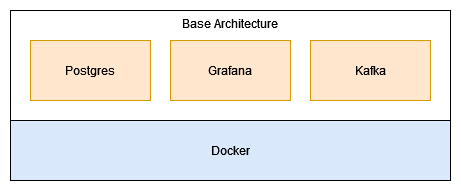

# ETL Pipeline

## Introduction
The ETL Pipeline project aims to provide an easily configurable and plug-and-play solution for running and integrating new datasets into an Extract, Transform, Load (ETL) process. It simplifies the process of setting up a robust ETL pipeline by utilizing a **run_etl.py** script, which ensures the base architecture and any required Docker containers are efficiently managed and operational.

## Prerequisites
+ docker
+ docker-compose
+ python 3.6 or later

## Architecture
The main idea is to provide a base arhictecture which consists of the following containers:

+ Grafana: For visualization
+ Postgres: For persisting the data
+ Kafka: For near-realtime event processing

These containers build the base architecture which is required for the datasets avalible in this repository. Kafka is an optional service which is not really required for this small scope but it is nice to have since it is used in many real world use-cases.  

